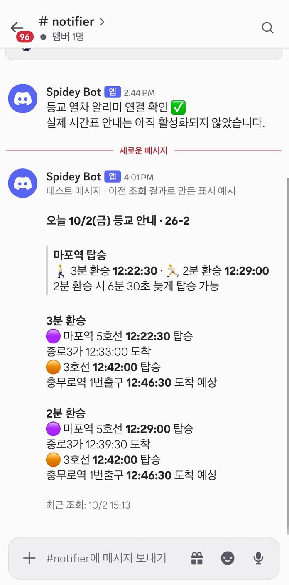

# commute-notifier · 26-2

마포역 5호선 → 종로3가역 3호선 → 충무로역 1번출구.
수업 10분 전까지 출구에 도착하려면 마지노선으로 마포역에서 몇 시에 열차를 타야하는지 계산하여 매일 디스코드로 안내합니다.

## 기능

- 공식 시간표를 조회해 환승 도보 3분·2분 두 경우의 수 계산
- 충무로역 1번출구 도보 2분 반영, 추가 여유 없이 마지막으로 탈 수 있는 열차 안내
- 전날 20:00·당일 06:00 발송
- 공휴일·휴강일 제외, 보강일 설정 지원


## 디스코드 발송 메시지 예시




## Windows 로컬 실행

```powershell
cd C:\WORKSPACE\commute-notifier
py -3.12 -m venv .venv
.\.venv\Scripts\python.exe -m pip install -r requirements.txt
Copy-Item .env.example .env  # 기존 .env가 있다면 생략
```

`.env`에 `SEOUL_API_KEY`, `DISCORD_WEBHOOK_URL`, `ALLOW_HTTP_SEOUL=true`를 설정합니다.
서울시 API는 HTTP를 사용하므로 인증키 전송이 암호화되지 않습니다. `.env`와 웹훅 주소는 GitHub에 올리지 않습니다.

```powershell
# 설정 확인 및 테스트
.\.venv\Scripts\python.exe manage.py check
.\.venv\Scripts\python.exe manage.py test
# 오늘 등교 안내 미리보기
.\.venv\Scripts\python.exe manage.py notify_commute --slot morning
# 디스코드 연결 확인 메시지 발송
.\.venv\Scripts\python.exe manage.py test_discord
# 다음 날 등교 안내 발송
.\.venv\Scripts\python.exe manage.py notify_commute --slot evening --send
```

`--send`가 없으면 미리보기입니다. 특정 등교일은 `--date YYYY-MM-DD`로 지정합니다.

## 무료 자동 실행 설정


1. 공개 GitHub 저장소에 코드를 업로드합니다.
2. Settings → Secrets and variables → Actions → New repository secret에 등록합니다.
   - `SEOUL_API_KEY`
   - `DISCORD_WEBHOOK_URL`
3. Actions → Commute notification → Run workflow에서 `date`를 등교일로 설정합니다.
   처음에는 `send`를 해제해 계산 결과를 확인합니다.
4. 같은 화면에서 `send`를 체크해 실제 채널 발송을 확인합니다.
5. 기본 브랜치의 예약 작업이 이후 자동으로 실행됩니다.

공개 저장소의 GitHub Actions 표준 Linux 환경을 사용합니다. 별도 서버·DB·도메인이나 유료 API는 사용하지 않습니다.
예약 실행은 정각을 보장하지 않으며, 공개 저장소는 60일 동안 활동이 없으면 예약 작업이 중지될 수 있습니다.

## 학기·휴강·보강 설정

새 학기에는 `semester.json`의 `name`과 `weekly_classes`를 바꿉니다.
요일 키는 `0`(월)부터 `6`(일), 수업 시각은 `HH:MM:SS`, 수업 없는 날은 `null`입니다.
방학 동안은 모두 `null`로 설정합니다. 학기 시작·종료일은 자동으로 판단하지 않습니다.

휴강·보강은 `calendar.json`에서 관리합니다. 아래 날짜는 형식 예시입니다.

```json
{
  "skip_dates": ["2026-10-06"],
  "extra_holidays": ["2026-11-02"],
  "class_overrides": {"2026-10-10": "10:00:00"}
}
```

`skip_dates`는 최우선 휴강, `extra_holidays`는 추가 공휴일, `class_overrides`는 날짜별 수업 시각입니다.
보강은 주말·공휴일에도 설정할 수 있으며 해당 날짜의 운행표로 계산합니다.

설정 변경 후 테스트하고 GitHub에 반영합니다.

## 데이터 출처와 한계

[서울교통공사 역별 열차 시간표 — 서울 열린데이터광장](https://data.seoul.go.kr/dataList/OA-101/A/1/datasetView.do)을 사용합니다.
데이터 갱신 주기는 비정기(자료 변경 시)이며, 매일 조회한다고 시간표가 매일 새로 갱신되는 것은 아닙니다.
조회 시점의 요일별 시간표를 사용하므로 향후 개정이나 실제 지연·혼잡·환승 속도에 따라 차이가 있을 수 있습니다.
